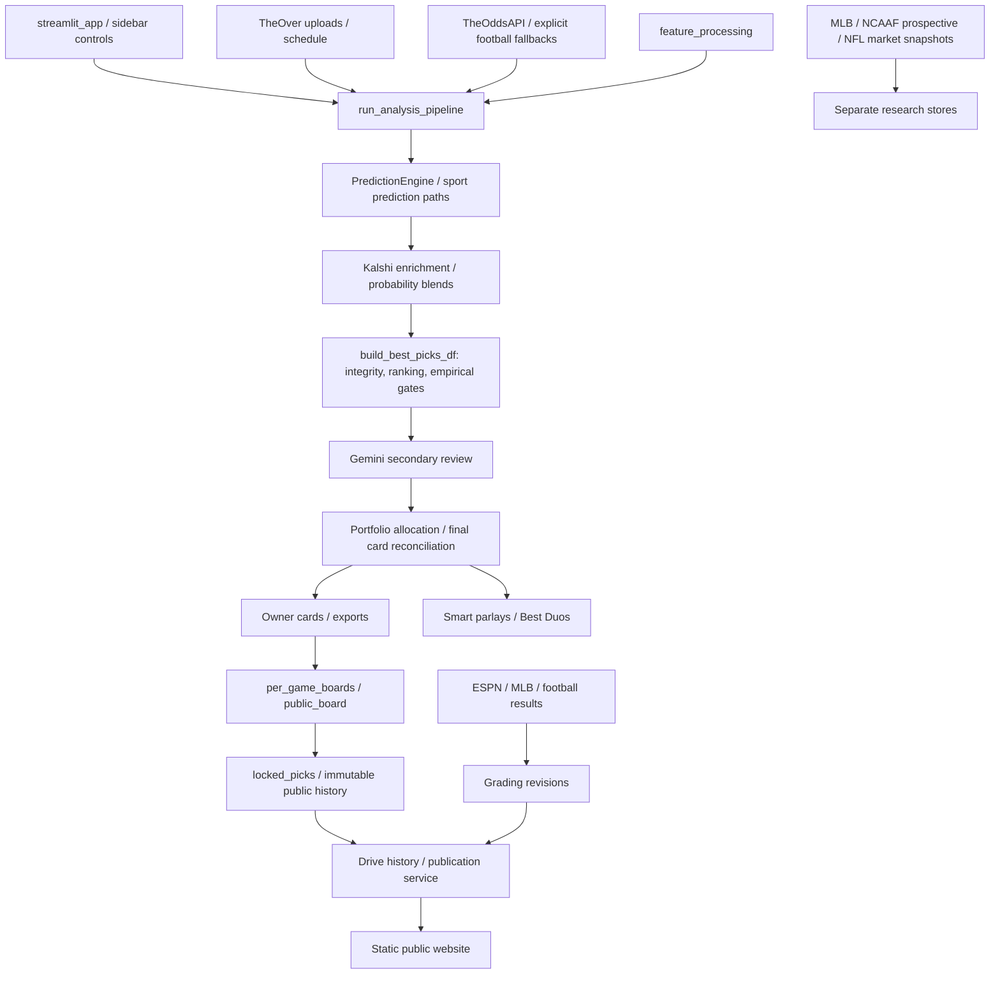

# ParlayPicker master repository audit — September 14, 2026

## Executive decision

**The repository is not yet validated for autonomous real-money recommendations.** This change implements integrity fixes and an isolated, testable wager/evidence contract. It does not certify a 75% system, turn research locks into actual bets, or activate unvalidated football stakes.

The principal findings are:

1. Moneyline exclusion was controlled by flags, with additional parlay paths that could admit it. Changed selection, publication and parlay boundaries exclude it from new recommendations.
2. The checked-in isotonic artifact claimed promotion despite a same-day train/test boundary. The default loader now refuses it.
3. Synthetic parlay prices could receive stakes, including sizing against a hardcoded $1,000 bankroll. Those generated combinations are now research-only with zero stake.
4. The supplied files contain 112 NCAAF games on September 12 and 13 NFL games on September 13. Missing games, missing candidates, research locks and approved wagers are different quantities.
5. The inspected historical evaluation has **1,176 candidate records but zero fully admissible evaluation games**. Historical results exist; a verified accuracy, 75% feasibility or incremental-value claim does not.
6. No validated sport-specific conservative probability distribution or approved football stake policy was found for activating the proposed engine. New policy defaults have zero allocation. Positive stakes in unit tests use explicitly synthetic policies.

This is an audit and implementation **toward** the requested standard. The acceptance ledger identifies unfinished production integrations and evidence prerequisites. They are not represented as deployed or complete.

## Baseline and reproduction

Baseline: `d9d4b5353ebdc25de6845fe3be04cd09194f7b02` (origin/main, merged PR #2269). Branch: `codex/wager-integrity-audit`.

Before edits: **1,958 tests passed**, 8,897 warnings, 105.12 seconds. Log: `test-results/master-audit-baseline.txt`. Local tests do not establish live-provider or deployment correctness. Most warnings are pandas fragmentation/deprecation warnings.

Data baseline: exact supplied September 12/13 candidate audits, with byte hashes in `2026-09-14-metrics.json`. These are archived snapshots, not a fresh September 14 slate. Candidate approval flags are not an executed-bet ledger. Earlier provenance evaluation and score reconciliation are explicitly dated September 13.

```powershell
python scripts/master_repository_audit.py --audit '<September 12 candidate CSV>' --audit '<September 13 candidate CSV>' --accuracy-report outputs/pick-accuracy-2026-09-13.json --output docs/audits/2026-09-14-metrics.json
```

The script hashes inputs, counts coverage and emits a static import graph. It does not call betting APIs, fit models or change thresholds. The initial inventory found 634 Python modules and six parse errors in archived snippets, none on the Streamlit import path. Static reachability includes optional/function-local imports; it is not proof a branch ran in a particular session.

## Actual architecture



`streamlit_app._run_pipeline` calls `run_analysis_pipeline`. Best Picks are built after enrichment, rather than inside the returned initial result. Gemini, portfolio allocation and later card recovery/reconciliation can change funding after candidate ranking. Public boards can select another same-game candidate to satisfy quote policy; only the exact approved final ticket may inherit funding.

Owner locking records explicit research selections separately from wager approval. The website performs no visitor-side odds calls. Browser refresh cannot refresh an exported quote. Scheduled research capture/grading does not prove publication to the custom domain.

### New isolated contract

`core.wager_decisions` evaluates each supplied spread/total candidate before selecting a matchup winner. It requires exact line/price identity, start/quote times, model/calibration identifiers and validation flags, frozen evidence, effective evidence size, conservative probability, push semantics, a validated policy, maturity caps and Gemini clearance. Missing evidence produces an explicit PASS.

Qualified candidates sort by conservative EV, then conservative probability and stable identity. A higher-probability expensive favorite can lose to a better-priced total. A rejected matchup retains its best research lean; a moneyline-only matchup remains PASS. Verified alternates receive BET ALT LINE. Material unresolved news produces WAIT only if it is the sole blocker. No line-movement forecast is invented.

This module is **not connected to live funding**. Boolean evidence flags are a trusted-adapter contract, not a model registry. Activation requires an adapter that validates artifact manifests, model availability and frozen prediction/quote provenance, then persists the complete decision. Do not populate validation flags merely because columns exist.

## Active versus legacy matrix

| Component | Classification | Finding / disposition |
|---|---|---|
| `streamlit_app.py`, `core/streamlit_pipeline.py` | Active owner application | Multiple ranking/gating/recovery stages; surgical integrity changes made. |
| `app_core/prediction_engine.py` | Active | Local XGBoost loader/fallbacks. `VERTEX_CONFIG` naming does not establish active Vertex serving. |
| `app_core/feature_processing.py` | Active | Sport provider fetches; market/default proxies can enter features. |
| `app_core/kalshi_integrator.py` | Active conditional enrichment | Event/date/team/line guards; matched signal differs from market proxy. |
| `app_core/gemini_bet_gate.py`, `integrations/gemini_client.py` | Active secondary review | No evidence justifies loosening review gates. |
| `core/empirical_tiers.py`, `production_gate.py`, `kelly_optimizer.py` | Active | Sport buckets exist; shared thresholds and point-estimate sizing are not validated sport policies. |
| `core/smart_parlay_engine.py`, `app_core/best_duos.py`, `public_parlays.py` | Active | Moneyline guards added; synthetic tickets cannot receive stakes. |
| `public_board.py`, `per_game_boards.py`, `locked_picks.py`, `public_history.py` | Active publication/history | Preserve records and PASS visibility; NFL result aliases fixed without changing lock IDs. |
| `app_core/ncaaf_research.py`, `ncaaf_prospective.py`, `ncaaf_closing.py` | Optional research UI/scheduler | Existing 2023/2024/2025 experiment, frozen paper models and manually observed closing proxies; not wager approval. |
| `app_core/mlb_prospective.py`, `nfl_market.py` | Research capture | NFL market snapshots are explicitly not independent forecasts. |
| `core/clv.py`, `scripts/capture_closing_lines.py` | Separate script | Legacy totals capture; arithmetic corrected, not certified as verified collection. |
| `app_core/feature_engine.py` | Alternate `daily_picks.py`, not Streamlit | Cross-group rolling/cumulative contamination fixed. Artifacts made with it still need lineage review. |
| Packaged `parlaypicker/core/parlay_engine.py` and portfolio optimizer | Alternate `main.py`/package | Not the Streamlit allocator. Retained to avoid breaking alternate entry points. |
| `core/vertex_master_analyzer.py`, `complete_workflow_implementation.py`, `gemini_integration.py`, `consolidated_workflow_complete.py` | No static Streamlit route found | Legacy/unproven runtime use; absence in one graph is insufficient deletion evidence. |
| `core/sport_policy.py`, `football_evidence.py`, `wager_decisions.py` | New offline contract | Tested, zero-cap defaults; not a promoted replacement model. |

No broad legacy deletion, model retraining, results reset or loss removal was performed.

## Source-of-truth audit

| Information | Source/path | Limitation |
|---|---|---|
| Events, starts, odds | `TheOddsAPIClient.get_odds`, `fetch_live_odds_dataframe`, provider quote JSON | Sportsbook website availability does not guarantee provider coverage. Exact event/side/line/book/time required. |
| Main markets | Defaults `h2h,spreads,totals`; Novig, DraftKings, FanDuel, BetMGM | Default request does not comprehensively enumerate alternates. |
| Football fallback | Explicit named books; separately labeled ESPN college observations | Observation time measures snapshot age, not sportsbook last-update age; research evidence. |
| Uploaded opinions | TheOver spreadsheet ingestion/provenance | Public percentages, historical hit rates and game forecast probabilities are different quantities. |
| Team statistics | `feature_processing.fetch_*`; NBA provider/cache, CFBD/ESPN football, NHL standings, ESPN/MLB StatsAPI | Current standings are not historical as-of features; cached/default inputs need provenance. |
| Kalshi | `enrich_with_kalshi_markets` | Contract must match date/game/team/line/direction; midpoint is not automatically calibrated or independent. |
| Injuries/weather/news | Inputs and secondary review | No universally verified six-sport feature manifest demonstrated; Gemini approval does not prove freshness. |
| Locks/results | Original public-history legs and grading revisions | Lock is not execution; corrections must preserve original odds. |
| Prospective evidence | `prediction_evidence`, sport stores, remote/Drive sync | Local record, backup receipt and published board are separate states. |
| Closing prices | NCAAF prospective proxy; legacy CLV script | No demonstrated complete six-sport production CLV cohort. |

The Odds API documents separate event odds/markets endpoints and update metadata. Main-market requests cannot establish alternate completeness. [Official API documentation](https://the-odds-api.com/liveapi/guides/v4/).

## Critical findings and actions

| ID | Priority | File / function / evidence | Action / test |
|---|---|---|---|
| W01 | P0 | `build_best_picks_df` flags expanded allowed markets; compatibility helper permitted ML legs. | Unconditional spread/total boundary and zero ML funding; moneyline wiring/audit tests. |
| W02 | P0 | `generate_parlays` funded product odds with $1,000 bankroll; `duos_to_smart_parlays` funded synthetic tickets. | $0 research with unverified-ticket metadata; parlay/duo tests. |
| W03 | P0 | `load_calibration` accepted `promotable=true` despite identical train-end/test-start dates. | Distinct chronological dates required; missing/same/reversed-date tests. Artifact retained as research data. |
| W04 | P1 | `evaluate_absolute_production_gate` could accept positive infinite EV. | Finite EV required; invalid Kelly inputs return zero. |
| W05 | P1 | `grading_team_name` generic aliases mishandled NFL Green Bay/full names and Minnesota. | NFL aliases, ambiguity preserved; lock identity unchanged. |
| W06 | P1 | Sept 12: 9 NCAAF spread families and 1 total absent despite provider quotes; preselection removes invalid/paired/shape-policy candidates. | Per-candidate reasons retained and downloadable. Exact removed historical rows cannot be recovered from surviving CSV. |
| W07 | P1 | `enrich_with_model_features` fills missing Kalshi feature from market/implied probability, then .5; market also enters later blends. | Double-counting risk confirmed; magnitude unmeasured. Needs ablation/retraining, not arbitrary weight patches. |
| W08 | P1 | Ranking precedes final qualification; selected row can fail while another may qualify. | New contract evaluates candidate gates before conservative-EV selection; live promotion awaits validated distributions. |
| W09 | P1 | `price_clv` mixed raw entry/de-vigged close; `closing_line_value` combined points/probability by constant. | Comparable bases, no universal conversion, conflicting directions unresolved. |
| W10 | P1 | Legacy `prepare_features_for_inference`: grouped shift followed by ungrouped rolling/cumsum. | Entire operation inside group transform; team/sport isolation regression. |
| W11 | P1 | Legacy `build_closing_snapshot`: totals-only, duplicate-ID overwrite, insufficient capture-time proof. | Not approved for promotion; extend stricter NCAAF prospective pattern. |
| W12 | P1 | Disjoint games/haircuts do not establish calibrated joint probability. Alternate packaged allocator uses simple same-game correlation. | No synthetic parlay funding; new exposure allocator is not claimed as learned correlation. |
| W13 | P1 | `spread_moneyline_orientation_fault` treats sign conflict as inversion; genuine alternates may disagree. Main-total bands exclude unusual lines. | Preserve ambiguity guards pending exact alternate provenance; isolated contract supports verified alternates. Broader ingestion remains unfinished. |
| W14 | P2 | Public-history schema lacks uniform persistence of every requested model/policy/evidence/review/correlation version. | Preserve IDs; complete immutable decision attachment required before live engine promotion. |
| W15 | P2 | Scheduler defaults MLB/NCAAF and depends on repo enable variable; domain publication separate. | Operating distinction documented; no unsolicited jobs/notification changes. |
| W16 | P3 | Six archived snippets do not parse; many pandas warnings. | Legacy/maintenance debt recorded; no broad deletion or suppression. |

## Market coverage and suppression baseline

Counts measure numeric candidate lines/prices in the supplied audits, not current availability or proven executable quotes.

| Snapshot / sport | Games | Rows | Spread games | Total games | Both | Spread only | Total only | Neither | Selected spread / total |
|---|---:|---:|---:|---:|---:|---:|---:|---:|---|
| Sept 12 MLB | 15 | 54 | 12 | 15 | 12 | 0 | 3 | 0 | 6 / 9 |
| Sept 12 NCAAF | 112 | 428 | 103 | 111 | 102 | 1 | 9 | 0 | 59 / 53 |
| Sept 13 MLB | 15 | 60 | 15 | 15 | 15 | 0 | 0 | 0 | 8 / 7 |
| Sept 13 NFL | 13 | 52 | 13 | 13 | 13 | 0 | 0 | 0 | 10 / 3 |

Moneyline candidate selections: **0** in both files. Moneyline context exists in provider JSON. Sept 13 NFL has no Novig quotes in that snapshot; DraftKings/FanDuel/BetMGM each cover 13 games. Sept 12 NCAAF has Novig spread/total quotes on 44 games and DraftKings quotes on 112. A Novig-only rule cannot cover that college snapshot.

Missing NCAAF spread families: Howard–Indiana, Wagner–James Madison, Old Dominion–Virginia Tech, Western Kentucky–Georgia, New Haven–South Dakota State, Grambling–TCU, Southern–Houston, Utah Tech–Montana, Morehead State–Austin Peay. Michigan–Oklahoma lacks totals candidates. Removed rows are absent from the export, so assigning a specific historical rejection reason to each would be speculation. The new exclusion download closes that diagnostic gap on future runs.

Recorded selected-row reasons:

- Sept 12 NCAAF: 105 final-safety rejections, 6 consensus-opposed, 1 unverified line/event. These aggregate reasons do not prove every row failed only sample size.
- Sept 13 NFL: 9 Gemini unavailable, 3 below MEDIUM, 1 below 60%.
- Sept 13 MLB: 9 Gemini below MEDIUM, 3 unavailable, 3 below 60%.

Selected `wager_approved` flags are false in both audit files. The final funded export and execution ledger are required for actual wager counts. NBA/NCAAB/NHL coverage is **unmeasured in these snapshots**, not zero availability. Alternate coverage is unmeasured, not complete. No retrospective reranking of these incomplete exports is presented as a valid before/after performance improvement.

## Calibration, 75% feasibility and incremental value

The checked-in artifact reports 1,155 graded rows, 924 train and 231 test. Train end and test start both equal August 16, 2026. Its recorded Brier is 0.248780 calibrated versus 0.249016 raw and 0.249884 constant baseline; log loss is 0.690688 versus 0.691196 and 0.692917. These are artifact metadata, **not newly verified out-of-sample results**. Strict loading now rejects promotion. A new splitter cannot retrospectively prove pregame feature/model provenance.

The existing `pick-accuracy-2026-09-13.json` evaluation inspected 1,176 records: 366 development exclusions, 168 not verified pregame, 128 identity failures, 502 missing prediction timestamps and 12 training-cutoff failures. Eligible evaluation events: **0**. The evaluation file hash and inventory are in the machine-readable audit.

For **each of NFL, NCAAF, NBA, NCAAB, MLB and NHL**, thresholds 55%, 60%, 65%, 70%, 75% have zero admissible games in that evaluation. Win rate, confidence interval, ROI, yield, Brier, log loss, ECE, CLV and time-to-approval are **not estimable**. JSON fields are null rather than invented 0% results. Premium 75% feasibility is **unsupported for every sport** by this evidence.

No admissible paired cohort establishes that moneyline context improves spread/total decisions or that Gemini improves win rate. Required experiment: freeze identical pools by sport/market/date; compare market-only, model-only, model-plus-moneyline and final blend on future games with exact price/push semantics. Score Brier/log loss/calibration, paired decisions, original-price ROI and same-line CLV; cluster uncertainty by slate/week. Fit weights only in development; evaluate once on untouched future slates. No new moneyline bonus, confidence boost or soft-Gemini promotion is justified before that test.

## Football evidence implementation

`SportPolicy` supplies separate instances for six sports. NFL/NCAAF hypotheses use weekly refresh; others use daily hypotheses. Each has version, validation ID, prior strength/decay/cap, current-season weight, minimum evidence, calibration/CLV/Gemini requirements, maturity caps, Kelly fraction, sport exposure cap and conservative quantile. Defaults have **no validation ID and zero caps/Kelly**. Existing WNBA application support is unchanged.

`freeze_evidence` accepts only same-sport, identified, verified pregame records with settled W/L, training cutoff before prediction, prediction before start, outcome/recording before freeze and slate start, prior season or prior week, valid spread/total probability, model/calibration version and source hash. It rejects duplicate IDs, future/same-slate rows and other sports. Historical evidence mass is capped. Metadata includes exact policy settings, week/season, freeze/start, source hashes, model/calibration versions, maximum outcome time, exclusions and content hash. Changed snapshots and parameter drift under the same version are rejected.

`reliability_distribution` is an **offline research hypothesis**, not calibrated production truth. It matches sport/model/calibration/market family, separates child probability-band/direction evidence from disjoint parent-family evidence, caps parent mass, estimates beta reliability and applies a residual log-odds correction. Outputs: mean, standard deviation, p10/p25/p50/p75/p90, effective evidence size and conservative probability bounded by the original game forecast. It does not replace every game with a bucket win rate. Jeffreys prior, bands and quantile still require walk-forward validation. Quantiles use the documented SciPy beta implementation. [SciPy reference](https://docs.scipy.org/doc/scipy/reference/generated/scipy.stats.beta.html).

No conference/FBS/FCS prior, quarterback regime score, CLV-driven promotion or borrowing strength was empirically selected. These are missing validations, not silently completed features. Existing NCAAF prospective frozen-model capture should supply future evidence rather than duplicating collection.

### Approval latency

**Weeks to first provisional/standard/premium approval are unavailable**: no verified longitudinal replay combines policy versions, contemporaneous quotes, predictions, reviews and approval times. The new contract supports capped PROVISIONAL decisions with defensible positive conservative value while preserving identity/price/model/feature blockers. Tests demonstrate behavior, not real-world latency or accuracy. Shared empirical thresholds (for example minimum bucket N=25 and recent-regime sample requirements) can delay sparse football; lowering them alone does not establish value.

## Probability, strategy and staking

Stages: original game forecast → separately calibrated mean → conservative probability → exact-price EV → qualified action → exposure-capped stake. A composite rank, historical hit rate or market-implied probability is not independent forecast confidence.

For decimal payout `d`, conservative unconditional win probability `p`, push probability `q`:

- Conservative EV per unit risk: `p*d + q - 1`.
- Break-even unconditional win probability: `(1-q)/d`.
- Minimum acceptable decimal price: `(1-q)/p`.
- Full Kelly with pushes: `EV / ((d-1)*(1-q))`, bounded below by zero.

Whole-number lines require explicit push probability; half points use zero. Missing exact lines or invalid/NaN/infinite probabilities, odds or caps fail closed. Bucket rate cannot substitute for `p`.

The isolated allocator only reduces requested fractions. It enforces current-bankroll total/sport/game/team caps including supplied committed exposure. Stable team IDs are required. Parlay risk must count against every underlying game/team. Locks cannot stand in for committed exposure because they are not executed bets. No forced deployment or stake floor is introduced.

No validated drawdown/ruin Monte Carlo result is available. A defensible simulation needs a joint outcome distribution and immutable stake path. Synthetic tests establish arithmetic/cap behavior only. Before nonzero policy promotion, run preregistered weekly-block simulations with uncertainty/correlation sensitivity, fees/slippage, loss streaks and concentration; report median/tail drawdown, ruin threshold and allocation sensitivity. Do not tune on evaluation slates.

## CLV, parlays, locks and performance

The existing NCAAF collector uses the latest observed same-book exact-line quote in the final 30 minutes before kickoff and labels it a **closing proxy**. It rejects postgame observations, mismatched events/starts, ambiguity and changed-line price comparisons. Its metric is entry decimal / closing decimal - 1, explicitly raw payout comparison, not no-vig probability CLV. This is stronger than the legacy totals script and is the appropriate extension pattern.

Legacy CLV arithmetic now uses comparable bases and selected-team spread signs. It no longer combines points and probability using a universal constant. Arithmetic alone is explicitly ineligible as verified evidence. Complete six-sport close collection and CLV-based maturity promotion remain unfinished.

Public parlays already label estimated product prices as research. Owner generators now match financially: **zero suggested stake until a validated ticket-pricing/joint-model path exists**. Different games do not prove independence. No parlay ROI, joint calibration, correlation benefit, volatility or incremental profitability is certified from these records.

Locks retain original pick/line/odds/estimate/time. Re-analysis does not replace them. Result aliases changed only in grading; old moneyline history remains gradeable. Complete immutable wager records still need model/calibration/policy/evidence/Gemini/correlation versions plus ticket/fill provenance, separate from research locks.

Dated descriptive results from the previous September 13 reconciliation:

| Slate / locked group | Wins | Losses | Win rate | Net at one unit risk per original lock |
|---|---:|---:|---:|---:|
| Sept 11 all | 9 | 11 | 45.0% | -3.373 units |
| Sept 12 MLB | 4 | 11 | 26.7% | -7.562 units |
| Sept 12 NCAAF | 56 | 35 | 61.5% | +13.084 units |
| Sept 12 combined | 60 | 46 | 56.6% | +5.522 units |

The 106 September 12 locks were reconciled to finals in that dated investigation. These are **selection records, not verified betting returns**; actual stakes/fees/slippage are unavailable. Overall/sides/totals overlap and must not be added. Reconstructing probabilities after results cannot establish calibration. A “70% run” does not establish a sustainable 70% forecast system.

## Acceptance and production-readiness ledger

| Requirement | Status | Remaining prerequisite |
|---|---|---|
| Moneyline context only | Implemented at changed active selection/publication/parlay boundaries | Maintain guards for additional entry points. |
| Every valid market, including alternates | Partial | Default feed lacks comprehensive alternates; historical rejected rows absent. Broaden exact-quote candidate architecture before claiming completeness. |
| One matchup decision / conservative value | Isolated contract implemented | Trusted adapter and validated distribution before replacing active research ranking. |
| Six isolated policies | Inactive configurations implemented | Per-sport/market empirical parameter selection. |
| Weekly football evidence | Offline freeze/hash/provenance implementation | Connect admissible stores and validate priors/cadence/uncertainty. |
| Provisional football funding | Contract tested, not activated | Validated positive conservative EV and nonzero stake policy. |
| Calibration / 75% | Not ready | Future verified cohort; current default artifact rejected. |
| CLV | Partial | Existing NCAAF proxy; complete sport/market capture and validated use absent. |
| Gemini | Existing gates retained | Paired prospective review study before softening. |
| Strategy timing / alternatives | Partial contract | No validated movement/liquidity forecast or full alternate coverage. |
| Bankroll / correlation | Arithmetic safeguards; promotion incomplete | Actual committed-exposure ledger, joint model and stress validation. |
| Parlays | Research-only integrity restored | Real ticket prices, compatible legs/books, joint probabilities and allocation. |
| Immutable results | Records preserved; NFL grading fix | Complete versioned wager payload and execution/closing linkage. |
| Production UI | Exclusion diagnostics added | Primary table should switch only with validated engine; no cosmetic BET NOW labels over unsupported data. |

A single numeric readiness score would conceal missing evidence. Six-sport 75% accuracy, nonzero football policies, real-price parlay funding and executed-return evidence are **not demonstrated**. Lowering thresholds cannot supply them.

## Exact change ledger

| File / function | Old → new | Reason / test |
|---|---|---|
| `core/market_policy.py` | New central spread/total allowlist | Audit market contract tests. |
| `streamlit_pipeline.build_best_picks_df` | Flags could add ML → unconditional exclusion | Context cannot become Best Pick; moneyline wiring tests. |
| `_enforce_moneyline_parlay_only` | Eligible ML legs → no-play/context-only, zero funding | Compatibility boundary cannot bypass policy. |
| `optimize_portfolio_allocation` | No explicit market boundary → spread/total required | Portfolio tests; legitimate Kelly fixtures now declare market. |
| `_filter_preselection_line_integrity` | Counts only → per-candidate rejection reasons | Explain absent families without weakening checks. |
| `app/ui/readiness_dashboard.py` | Ranked audit only → excluded-market download | Current-run visibility; no network calls added. |
| `per_game_boards.per_game_board` | Could select ML fallback → filter with visible unavailable PASS | Publication regressions. |
| `public_board.pick_record` | No market boundary → reject ML / unknown market held at PASS | Publication contract tests. |
| `locked_picks.lock_candidates/lock_audit`, `pick_of_day._game_candidates` | Cached ML could bypass current selection → new ML locks/recommendations blocked; saved locks preserved | Cached-market regression. |
| `public_parlays` builders | No explicit allowlist → spread/total legs only | Public parlay tests. |
| `smart_parlay_engine` generators / `best_duos.build_best_duos` | ML admission possible → explicit exclusion | Active research/parlay boundary. |
| `generate_parlays`, `duos_to_smart_parlays` | Synthetic price funded → $0 research, ticket unverified | No executable ticket or fabricated bankroll; duo/parlay regressions. |
| `probability_calibration.load_calibration` | Boolean promotion → distinct chronological dates | Missing/same/reversed-date tests. |
| `production_gate.evaluate_absolute_production_gate` | Non-null inf EV allowed → finite required | Invalid-number regression. |
| `kelly_optimizer.kelly_fraction` | Invalid values propagate → zero | NaN/inf/bool/bad-price tests. |
| `nfl_identity.nfl_result_name`, `public_history.grading_team_name` | Generic aliases → NFL grading aliases | Green Bay/Minnesota/city ambiguity tests; lock IDs unchanged. |
| `feature_engine.prepare_features_for_inference` | Rolling/cumsum crossed groups → group-local transforms | Legacy team/sport isolation test. |
| `clv.price_clv/line_clv/closing_line_value` | Mixed bases/conversion → comparable bases/separate directions | CLV tests; no promotion of unverified captures. |
| `sport_policy`, `football_evidence`, `wager_decisions` | New isolated conservative contract | Hash roundtrip, policy drift, leakage, uncertainty, pushes, selection, exposure and alternate tests. |
| `scripts/master_repository_audit.py` | New reproducible hashed inventory | Read-only coverage/import report; input filenames/hashes retained. |
| `.github/workflows/ci.yml` | Safety list → new audit tests included | Full suite and production compile remain required. |

## Remaining production milestones, in dependency order

1. Capture full preselection pools, exact event/side/line/book/time, original model/push forecasts, feature as-of times and version manifests through existing evidence stores. Preserve each run.
2. Complete sport-specific chronological baselines and moneyline/market/Kalshi/Gemini ablations. Treat market-proxy features as correlated evidence, not independent votes.
3. Validate football borrowing, uncertainty and maturity on historical seasons with untouched future tests. Demonstrate genuine positive conservative-EV provisional candidates while preserving hard blockers.
4. Connect the new contract through a trusted artifact/evidence adapter. Persist complete decisions, shadow-compare current ranking and validate market coverage before enabling funded output.
5. Validate actual exposure accounting and joint-risk simulations, then activate nonzero caps. Add executable parlay ticket prices before any parlay funding.
6. Extend prospective closing capture and cohort-specific calibration/CLV/ROI/latency reports. Switch the primary UI to validated decisions.

No existing losses, locks or grades were removed to improve results. No unsupported accuracy improvement or production promotion is claimed.

## Final verification

Final full suite: **2,003 passed**, 8,748 warnings, 104.61 seconds (`test-results/master-audit-final-verified.txt`). Baseline was 1,958 passed; 45 additional cases now pass. Production compilation (`app`, `app_core`, `core`, training entry point, Streamlit entry point and audit script) and `git diff --check` passed. Warnings remain visible; they were not suppressed to obtain this result.

These are local regression results, not proof of provider availability or deployed behavior. Changes are local on `codex/wager-integrity-audit`. The user authorized a local commit after automatic approval review blocked the earlier combined commit/push operation. No push, PR or deployment is included in this local delivery. Unvalidated research contracts are not promoted into the live wager pipeline.
